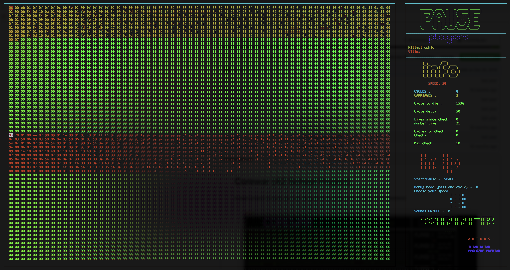

# Corewar

Corewar is a team project that is devoted to building an assembler interpreter of code of external champions and own virtual machine that processes the byte code from assembler interpreter.

## Visualization:



## The project is divided at three parts:

**1. Assembler interpreter: Nikotiner (dlian) and Haski007.**

This is the program that will compile champions and translate them from the language written them in (assembly language) into “Bytecode”. Bytecode is a machine code, which will be directly interpreted by the virtual machine.

**2. Virtual machine: Somaliika**

It’s the “arena” in which champions will be executed. It offers various functions, all of which will be useful for the battle of the champions. Obviously, the virtual machine should allow for numerous simultaneous processes.

**3. Visualization: past77 (Pavlo POLOZHEVETS)**

This is a console window coded with incursis library to show the battle. The native shell (for example, Terminal.app for macos) could show higher permormance than the third-party applications like iTerm. 

## How to run:
```
git clone https://github.com/Somaliika/corewar.git ~/corewar/

cd ~/corewar/

make

./asm [file.s] (use any file from /vm_champs/champs/ and all inside this folder)

./corewar [-v | -dump N] [-a] [-n N] <champion1.cor> <...>
```
-v : Enables visualization

-dump N : Dumps memory after N cycles

-a : Prints output from 'aff' (Default is to hide it)

-n N : Assigns id N to the player specified right after N

*Pay attention! [-v] has higher priority when is used with [-dump]. Maximum number of champions - 4*
